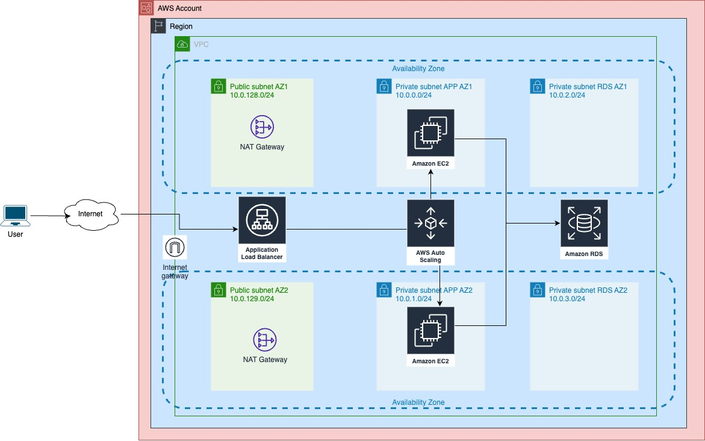

# Interview Test

- All the resources were tagged with the name *andres-test*
- Folder *env-vars* contains one Terraform environment variables file per each environment. For now, the only environment is "sandbox"
- The Terraform backend (bucket S3 and DynamoDB Table) must be created before of creating the other infrastructure. These resources are inside of the folder *terraform-resources*, and their creation is explained in the section *Environment Deployment*
- Folder *iac* contains the Terraform code, this code must be deployed according to section *Environment Deployment*
- Inside each folder on *iac* there is a child folder that contains the backend configuration file, there is one file per environment.

## Folder Structure
```
├── README.md
└── terraform
    ├── env-vars
    │   └── sandbox.tfvars
    ├── iac
    │   ├── instances
    │   ├── networking
    │   └── rds
    ├── modules
    │   ├── alb
    │   ├── instance
    │   ├── network
    │   └── rds
    └── terraform-resources
        ├── dynamodb.tf
        ├── pending-changes-sandbox
        ├── provider.tf
        ├── s3.tf
        ├── terraform.tfstate.d
        ├── terraform_apply.sh
        ├── terraform_plan.sh
        └── variables.tf
```

## Infrastructure Diagram




## Environment Deployment
There are several scripts called *terraform_plan.sh* and *terraform_apply.sh*, these scripts automate the deployment process. Navigate to the following folders (in the same order they are presented) and execute the commands shown below:

- terraform-resources
- iac/networking
- iac/instances
- iac/rds

```
cd <path/to/the/folder>
bash terraform_plan sandbox
bash terraform_apply sandbox
```

## EC2 Instances Access
The following command can be used to access to the EC2 instances. AWS CLI must be configured previously to execute this command.

```
aws --region us-west-2 ssm start-session --target <INSTANCE ID>
```

## Autoscaling Group 
The EC2 instances created are included inside of an Autoscaling Group, that has the min capacity set to 2, the max capacity set to 4, and the desired capacity set to 2. But it changes according to the following policies:
- When CPU load hits 65% or higher it needs to scale up, 
- When CPU load hits 40% or lower it needs to scale down

### Stress Test
In order to test the Autoscaling Group Policies, the CPU usage must be increased. It can be done by logging in one of the instances (check section *EC2 instances Access*) and typing the following command:

```
stress --cpu 2
```

## Database access
The databse configured is a Postgres database, and can be accessed only to the EC2 instances, that is why it can be reached only by using a tunnel SSH and a portforwarding with one of the instances deployed. The following command creates the tunnel and the portforwarding rule. After executing this command in a local machine configured with an AWS CLI user with enough permissions, the database endpoint should be available at *localhost:5432*

```
aws --region \<REGION\>  ssm start-session --target <INSTANCE ID> \
--document-name AWS-StartPortForwardingSessionToRemoteHost \
--parameters '{"portNumber":["5432"],"localPortNumber":["5432"],"host":["<RDS ENDPOINT>"]}'
```

The database credentials are store in the secrets with the following ID: *arn:aws:secretsmanager:\<REGION\>:\<ACCOUNT-ID\>secret\:andres-test-RDS-Credentials-test-\**.

## Additional considerations
- The application was expossed over port 80 because of the lack of an SSL certificate, but in a real environment it must be exposed over HTTPS on port 443.
- To reduce the cost of the infrastructure involve in this test, the auto scaling group desired capacity was set to one, but to provide high availability in a real environment it must be set with a minimum value of two.
